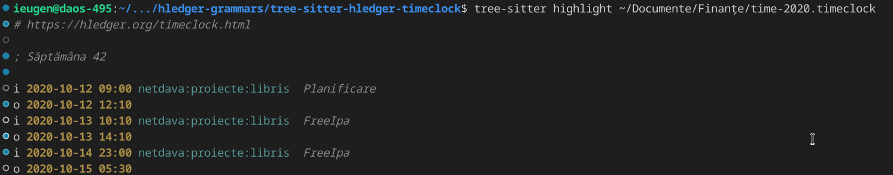

= tree-sitter grammer for hledger

Exploring tree-sitter grammer since it is more popular for editors and IDEs.

== Features

- [x] Parses timeclock files
- [x] Parses simple date format
- [x] Parses time
- [x] Accepts both ':' and '.' as account separators
- [x] Syntax highlighting
- [ ] Example for auto completion for accounts ?!

.Timeclok Abstract Syntax Tree for a simple 1 posting entry
[source,scheme]
--
(source_file
    (clock_in
        (simple_date)
        (time)
        (account_name)
        (tx_description))
    (comment)
    (clock_out
        (simple_date)
        (time)))
--

== Developing the grammar

Tree-sitter has a nice guide on how to work on grammars.
https://tree-sitter.github.io/tree-sitter/creating-parsers

The workflow is like this:

- Add a test in `test/corpus` for the use case you care.
- The test will fail initially.
- Make grammar changes for your language feature
- Update test expectations to match the grammar
- All other tests should pass
- Use filter and debug options to narrow down the amount of text you view

You can get inspiration on how to solve most issues by going through the existing list of tree-sitter parsers https://tree-sitter.github.io/tree-sitter/#parsers .

[source,shell]
--

# change directory to grammar dir
cd tree-sitter-hledger-timeclock
# Install dependencies
npm install

# Make sure you have tree-sitter on path
export PATH=$PATH:./node_modules/.bin

# Generate the tree-sitter parser from js definition
tree-sitter generate

# Run grammar tests. Do it after every grammar change.
tree-sitter test

# Filter only a specific test and show debug
tree-sitter test -f 'timeclock example' -d

# Filter only a specific test and produce debug log in log.html
tree-sitter test -f 'timeclock example' -D
--

Parse a file that you have and see the output.

[source,shell]
--
# Parse a timeclock file for test
tree-sitter parse my/test/time-2020.timeclock
--

== Syntax highlighting

You should read the steps to enable this: https://tree-sitter.github.io/tree-sitter/syntax-highlighting

First you need to initialize tree-sitter config and add the path to timeclock grammar (this git repo).

On my system I had to:
    tree-sitter init-config

Then I added the path to timeclock grammar:

.config/tree-sitter/config.json
[source,json]
--
{
  "parser-directories": [
    "/home/ieugen/github",
    "/home/ieugen/src",
    "/home/ieugen/source",
    // Added the part below, update path accordingly:
    "/home/ieugen/proiecte/hledger-grammars"
  ],
  //...
}
--

Once this is done, you should be able t highlight timeclock files.

[source,shell]
--
# Check syntax highlighting
tree-sitter highlight my/test/time-2020.timeclock
--

You should get sometething that looks like this:

